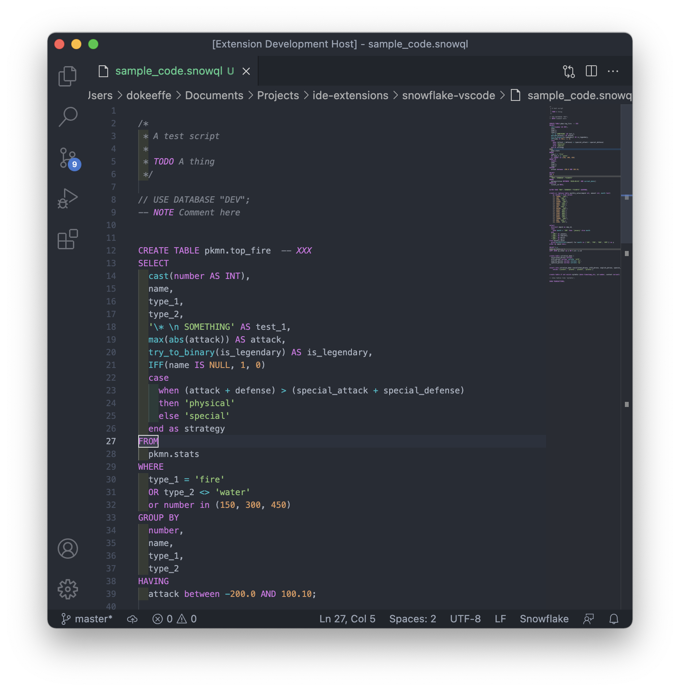

# Sneachta Syntax Highlighter

'Sneachta' is the Irish word snow.

This extension will highlight keywords and functions for  [Snowflake SQL](https://www.snowflake.com/) in VSCode.

> **Disclaimer:** This extension is not affiliated with, endorsed by, or sponsored by Snowflake Inc.

## Features

Thanks for using this extension. If you have any issues you can report them via github. If you'd like to support development on this my donation links are at the bottom.

The aim of this extension is the give a more accurate syntax highlighting for Snowflake SQL flavour used in the Snowflake data warehouse. It colours keywords such as `IFF` to distinguish them from other database flavours of SQL, like Hive or Presto, so that code is more readable.

The plugin automatically activates Snowflake syntax highlighting for files with the extension `*.snowql`.

Happy coding!

## Issues

Feedback is always welcome.
If you find any bugs or issues with the extension please open an issue [here on Github](https://github.com/okeeffdp/sneachta-syntax/issues).

##  Release Notes

Release notes can be found in the [CHANGELOG](./CHANGELOG.md).

## Support

Beer money is always welcome! 🍺

| Currency | Method |
| ------ | ----- |
| Nano | [PayNano.me](https://paynano.me/nano_1ry8urb6sdoeri6hcsdtrok518i6ybtnqtxf9d7hnyer6tr3xxpwj3gk6hyg) |
| Bitcoin | bc1q0fryx7fh6zuqj6840px73nvqlmg096t3h5c59v |
| Ethereum | 0x896DE4E51f6921e25a3E99a2A56982C762509f9B |

Go raibh mile maith agat a chara! 🇮🇪
